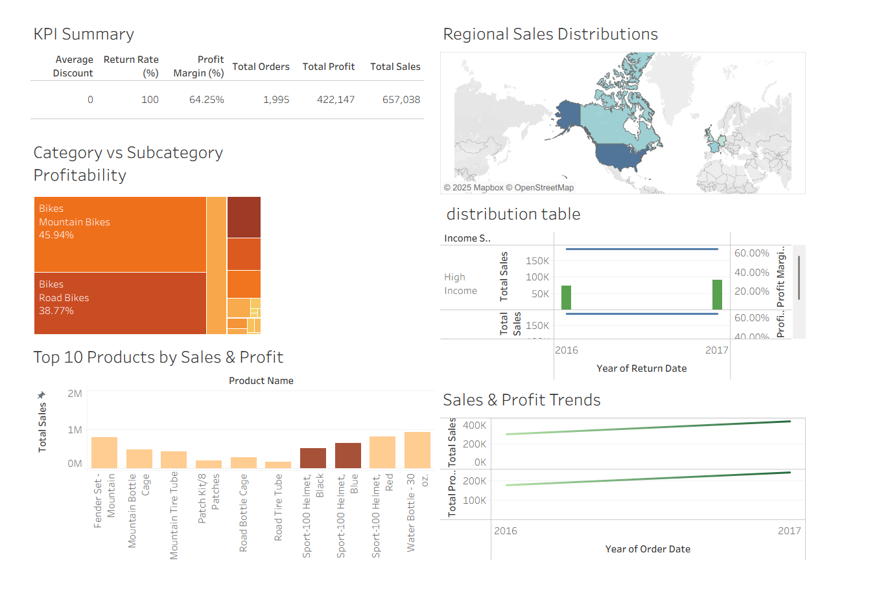

1️⃣ 📊 Sales Performance Analytics Dashboard – Tableau

  <b>Interactive Tableau Dashboard for End-to-End Sales & Profitability Analysis</b> 
  KPIs • Products • Categories • Regions • Trends • Business Insights

---

2️⃣ 🚀 Project Overview
This project presents a **comprehensive Sales Performance Analytics Dashboard** built using **Tableau**, based on structured sales transaction data.

The dashboard is designed to provide **clear visibility into sales health**, profitability drivers, product performance, and regional distribution. It enables business stakeholders, analysts, and decision-makers to **quickly identify trends, opportunities, and performance gaps**.

The focus of this project is **pure sales analytics** — no inventory, HR, or operational data — making it ideal for demonstrating **core business intelligence and visualization skills**.

---

3️⃣ 🎯 Objectives of the Dashboard
- Monitor overall **sales and profit KPIs**
- Identify **high-performing categories and subcategories**
- Analyze **top products by sales contribution**
- Understand **regional sales distribution**
- Track **year-wise sales and profit trends**
- Support **data-driven sales and pricing decisions**

---

4️⃣ 🧠 Business Questions Answered
1. What are the **overall sales and profit figures**?
2. How strong is the **profit margin** across the business?
3. Which **categories and subcategories contribute most to profit**?
4. What are the **top 10 products by sales and profit**?
5. How are **sales distributed geographically**?
6. Are **sales and profits growing consistently over time**?

---

5️⃣ 📌 KPI Summary
| KPI | Value |
|----|------|
| 🎯 Average Discount | **0** |
| 📉 Profit Margin | **64.25%** |
| 🛒 Total Orders | **1,995** |
| 📈 Total Profit | **422,147** |
| 💰 Total Sales | **657,038** |

📌 **Interpretation:**  
A high profit margin combined with zero discounting indicates **strong pricing power and efficient cost control**.

---

6️⃣ 📈 Detailed Insights (Senior Data Analyst Perspective)

6.1 🔹 Category vs Subcategory Profitability  
- **Bikes** category dominates total profitability.
- **Mountain Bikes** and **Road Bikes** together account for the majority of profit share.
- Other categories contribute marginally, suggesting a **core-product-driven business model**.

6.2 🔹 Product-Level Performance  
- Top products include helmets, bottles, and bike accessories.
- Indicates strong **add-on and cross-selling potential** alongside main products.
- Product concentration highlights opportunities for **portfolio expansion**.

6.3 🔹 Regional Sales Distribution  
- **North America** contributes the highest share of sales.
- Other regions show stable but lower contribution.
- Insights support **region-specific marketing and expansion strategies**.

6.4 🔹 Sales & Profit Trends  
- Sales and profit both show **steady upward movement over time**.
- Indicates healthy demand, pricing stability, and operational efficiency.
- Useful for forecasting and strategic planning.

6.5 🔹 Overall Business Health  
- High margin + consistent growth = **financially healthy sales performance**
- Low volatility suggests predictable revenue streams.

---

7️⃣ 🌐 Live Tableau Public Dashboard
🔗 **View the Interactive Dashboard Online:**  
👉 https://public.tableau.com/app/profile/praveen.tiwari4211/viz/Book1_17606846361750/Dashboard2?publish=yes

📌 *This live version allows users to interact with filters, tooltips, and visuals.*

---

8️⃣ 🖥 Dashboard Preview
🔗 **Static Preview Image**

---

9️⃣ 🛠 Tools & Technologies Used
- **Tableau Desktop** – Dashboard creation & analysis
- **Tableau Public** – Dashboard publishing & sharing
- **Microsoft Excel** – Data cleaning and preparation
- **Calculated Fields** – KPIs, margins, trends
- **Sales Analytics Concepts** – Revenue, profit, category & regional analysis

---

---

1️0 🎯 Business Impact
This dashboard helps organizations to:
- Monitor sales and profitability in real time
- Identify high-impact products and categories
- Understand geographic demand patterns
- Support pricing and sales strategy decisions
- Communicate insights clearly to leadership

---

11 👤 Author
**Praveen Tiwari**  
Aspiring Data Analyst | Tableau | Power BI | Excel | Business Analytics  

